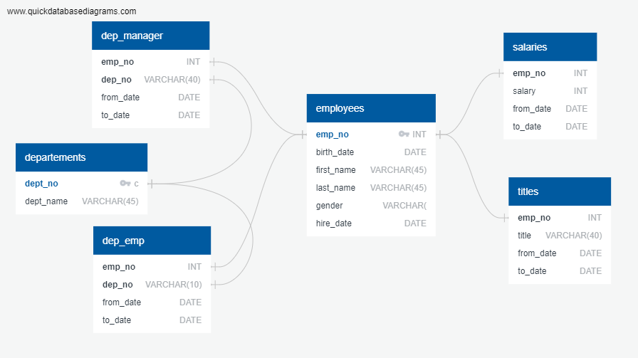
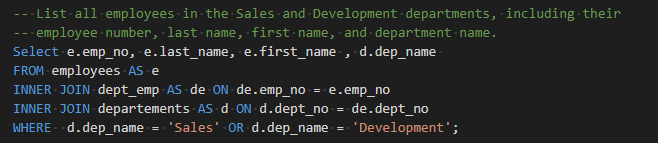
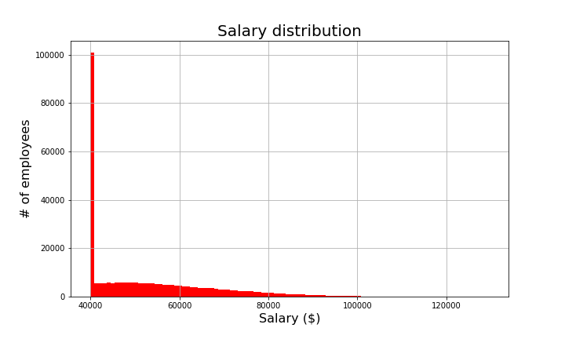
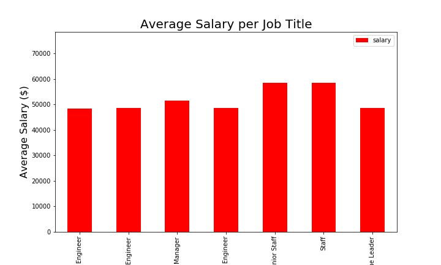

# SQL-Employee Database

Project Summary:
SQL (Structured Query Langauge) is the standard language for managing relational databases [SQL](https://en.wikipedia.org/wiki/SQL). Here I am using SQL to inspect several aspects of a database build using PostgreSQL from several csv datasets. 

## Requirements
The main requirements are listed below:

- PostgreSQL 
- ERD (entity relationship diagrams)
- Python 
- Numpy
- Sqlalquemy
- Matplotlib

## DATA
The project incorporates three aspect of the data: 

    Data Modeling
    Data Engineering
    Data Analysis

### DATA MODELING

Data consist in several csv tables [EmployeeSQL/data] . The first stefp is inspecting the files scketching an ERD of the tables. The visual representation of the database releations ERD (entity relationship diagrams) are created using free source http://www.quickdatabasediagrams.com. 

### DATA ENGINEERING

With the ERD, the table schema for each table is created, specifying data types, primary keys, foreign keys, and other constraints.  The schema of the tables can be found in [EmployeeSQL/squema.sql](EmployeeSQL/squema.sql)

### DATA ANALYSIS 

Once the database is built , the analysis is done querying information such as : 

- 1 each employee a list containing: employee number, last name, first name, gender, and salary.
- 2 list of employees hired in 1986
- 3 for each department manager: department number, department name, the manager's employee number, last name, first name, and start and end employment dates.
- 4 .. 

### More data analysis

The SQL database can be imported into Pandas with sqlalquemy by greating an engine and establishing the conection to the database in postgres. The data showed an unusial distribution of salaries. 

In addition, the average salary for the different positions also showed similar trend. The data was heavily squed toward $40.000

The dataset is clearly faulty - nice way for fake -. Look for the employee umber 49,9942 in [EmployeeSQL/data_analysis.ipynb](EmployeeSQL/data_analysis.ipynb) 

#------------------------------------------------------------------------------------------------
#
## Feel free to contact me
* Marina Marinkovic/PdeM: [LinkedIn](https://www.linkedin.com/in/marinamarinkovic/) | [GitHub](https://github.com/MPdeM)
